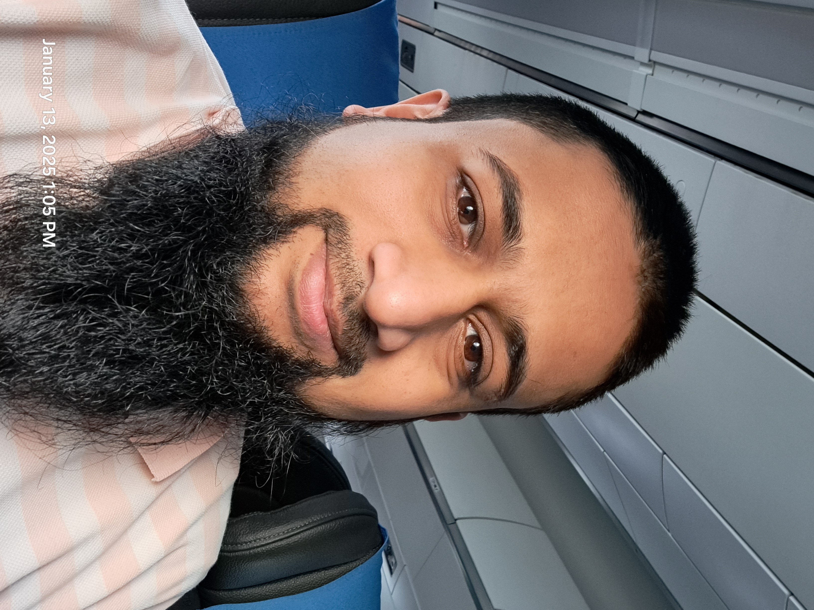

# Introduction

Hello, My name is Shabbir Marzban. I'm a seasoned Applied Scientist with a passion for Computer Vision, Machine Learning, Deep Learning, and Geospatial Data Science. Over the past ten years, I've spearheaded innovative projects at top organizations, developing advanced AI solutions that range from mapping and brand analytics to medical imaging. Currently, I’m working on algorithms that enable speed limit indications in navigation technology, improving the reliability of digital maps. With a solid academic foundation in Computer Science and Electrical Engineering, I thrive on turning complex challenges into tangible, impactful technology solutions. 

[Email](mailto:shabbir.marzban@outlook.com) &#124; [Google Scholar](https://scholar.google.com/citations?user=IOPXCFQAAAAJ&hl=en) &#124; [Blog](./blog.html) &#124; [LinkedIn](https://www.linkedin.com/in/smarzban/) &#124; [WhatsApp](https://wa.me/31685343018) &#124; [gpg](./gpg.txt) 

## Work Experience

### **Staff Applied Scientist**, **[TomTom](https://www.tomtom.com)**  
*Dec 2023 – Present*  
- Working on algorithms that enable speed limit indications in navigation technology, improving the reliability and efficiency of digital maps.

### **Senior Machine Learning Researcher**, **[Promaton](https://www.promaton.com)**  
*June 2021 – Nov 2023*  
- Led research and development of AI-based tooth shape estimation and prediction techniques for dental imaging solutions.  
- Enhanced project management and software engineering skills while developing AI-driven solutions.

### **R&D Engineer**, **[Navinfo Europe](https://www.navinfo.eu)**  
*Jan 2019 – May 2021*  
- Researched and developed **RGPNet**, a semantic segmentation network for street-level images, with a training technique that reduces energy consumption by 75%.  
  - [WACV 2021 Paper](https://arxiv.org/abs/1912.01394) &#124; [Video](https://youtu.be/v3z3uzoeWA0)  
- Worked on object detection and segmentation models optimized for limited compute resources.  
- Developed methods to detect wear on road markings using dashcam video data.  
  - [Research Paper](https://arxiv.org/abs/2106.02567)  

### **Computer Vision Engineer**, **[Uru (acquired by Adobe)](https://www.crunchbase.com/organization/uru)**  
*Jan 2017 – May 2018*  
- Developed deep learning models for **brand analytics** and **brand safeness scoring** in videos.  
- Built a detector for **800+ unique brands** (e.g., Coca-Cola, Nike) to analyze video content.  
  - [Medium Blog Post](http://bit.ly/2QmCgHK)  
- Researched and implemented deep learning models to extract geometry from single-image depth predictions for **3D augmentations**.  
- Co-inventor on **two patents** owned by Adobe.

### **Research Engineer (Computer Vision)**, **Ingrain (ingrain.io)**  
*Oct 2015 – Dec 2016*  
- Developed mobile **Augmented Reality tracking** technology beyond Pokémon GO.  
- Built algorithms for **automatic ad placements in videos**, prototyped in Matlab and deployed in C++ (OpenCV).  
- Led a team of recent graduates, optimizing tracking technology in non-static videos.

### **Research Assistant**, **[IUI](https://iui.ku.edu.tr/) and [MVG](https://mvgl.ku.edu.tr/) Labs, Koç University**  
*Sept 2013 – Aug 2015*  
- Researched recognition, detection, and synthesis of **affective events** in speech and gestures.  
- Implemented a system to detect **affect bursts** (laughter, breathing sounds) from multi-modal input.

### **Research Assistant**, **[Computer Vision Lab](https://cvlab.lums.edu.pk/), Lahore University of Management Sciences (LUMS)**  
*Sept 2011 – July 2013*  
- Researched a novel **3D reconstruction approach** from multiple camera feeds, published in ICCV.  
- Worked on **automatic 3D structure recovery** of heritage sites using aerial images and videos.  
- Conducted tutorials and supervised projects on non-rigid structure recovery.

## Teaching Experience

### **Koç University**  
*Graduate Teaching Assistant*  
- **COMP 408/508: Computer Vision and Pattern Recognition** (*Sept 2014 – Jan 2015*)  
- **COMP 132: Advanced Programming** (*Jan 2014 – May 2014*)  
- **COMP 131: Introduction to Programming** (*Sept 2013 – Jan 2014*)  

### **Lahore University of Management Sciences (LUMS)**  
*Undergraduate Teaching Assistant*  
- **CS 436: Computer Vision Fundamentals** (*Aug 2012 – Dec 2012*)  

